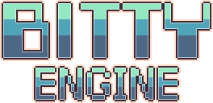

# bitty-go 
This is Golang port of [Bitty Engine](https://github.com/paladin-t/bitty), Bitty Engine - An itty bitty 2D game engine, with built-in editors, programmable in Lua.
## snapshot 

## readme 
[README](https://github.com/chunqian/bitty/blob/main/BITTY_README.md)

## from 
[Bitty Engine](https://github.com/paladin-t/bitty)
